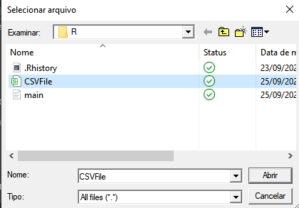

# FirstLPWork

## Prática

Escolher duas linguagens de programação distintas, de preferência uma interpretada e uma compilada, e com ambas ler o arquivo excel disponibilizado e fazer:

* Tratar os dados e retirar possíveis <i>NAN</i>.
* Construir <b>n</b> matrizes 12x12 deslizando por todo o arquivo.
* A cada matriz gerada, calcular a sua inversa.
* Por fim, avaliar a resolução do problema em ambas as linguagens escolhidas.

---

## Linguagens utilizadas

Para a resolução deste problema, foram escolhidas linguagens que lidam bem com a manipulação de dados em alta escala e que possam fazer operações matemáticas de forma trivial. Visando o aprendizado de novas linguagens, fora escolhido: <a href="https://julialang.org/">Julia</a>, uma linguagem nova e compilada conhecida por ser próxima ao python e ser mais rápida que este, e, como linguagem interpretada <a href="https://www.r-project.org/">R</a>, uma linguagem funcional comumente utilizada em aplicações estatísticas.

## Avaliação das linguagems

<table border="1">
    <tr>
        <td>Linguagem</td>
        <td>Nível de segurança</td>
        <td>Confiabilidade</td>
        <td>Paradigma da linguagem</td>
        <td>Classe</td>
    </tr>
    <tr>
        <td>R</td>
        <td>Alto</td>
        <td>Médio</td>
        <td>Funcional</td>
        <td>Interpretada</td>
    </tr>
    <tr>
        <td>Julia</td>
        <td>Alto</td>
        <td>Alto</td>
        <td>Multiparadigma</td>
        <td>Compilada</td>
    </tr>
</table>

## Resolução do problema

 Em ambas as linguagens escolhidas, a resolução do problema foi ligeiramente simples, ambas lidam com a leitura de arquivo e a manipulação de matrizes facilmente, tendo funções próprias para inverter matrizes, o que já lida com a maioria da dificuldade da tarefa.

### Desempenho

 Em desempenho, esperava-se mais da linguagem Julia, dita como mais rápida que python, teve uma média de 1 minuto de execução do programa, já a linguagem R surpreendeu, obteve-se uma média de 30 segundos, 50% a menos que a primeira linguagem.

### Facilidade de Escrita e Legibilidade

 Ambas apresentaram grande facilidade de escrita e legibilidade com códigos pequenos e diretos o programa possui fácil entendimento.

### Confiabilidade

 As duas linguagens possuem alta confiabilidade quando o assunto é tratamento de erros, exceções e simplicidade, porém pecam na verificação de tipos, visto que ambas são fracamente tipadas.

# Compilação e execução

## Julia

Para a execução do programa em Julia recomenda-se o uso da IDE Visual Studio Code, que oferece extensões para o uso da linguagem e a executa com o comando padrão da IDE "CTRL + F5".

## R

Para a execução do programa em R, recomenda-se o uso da IDE própria da linguagem, <a href="https://www.rstudio.com/">RStudio</a>. Para que o programa possa reconhecer o arquivo CSV a ser lido o usuário deve selecioná-lo durante a execução do programa, nesta aba:

